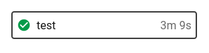
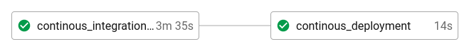

# config.yml 

# Conceptos importantes

## Branches
El repositorio de github adopta una estrategia que permita separar las versiones inestables de las versiones probadas y listas para desplegar.

- master:
```
Cada commit en esta rama significa una nueva version del sistema de inventario.
```
- hotfix: 
```
Al presentarse un error en master se resuelve bajando los cambios a esta rama para arreglarlo y luego volver a subirlo a master.
```
- developer: 
```
En esta rama estaran los commits con versiones inestables.
```
- backend: 
```
En esta rama se realizaran los commits de todo el codigo relacionado al backend que esta escrito en nodejs.
```
- frontend: 
```
En esta se realizaran los commits de todo el codigo relacionado al frontend que esta escrito en vuejs 
```
- infrastructure: 
```
En esta rama se realizaran los commits de todo el codigo relacionado a los archivos .tf de terraform para aprovisionar los recursos y los archivos .yml de recursos que se desplegaran en el cluster GKE.
```
## Workflow


Un workflow es un conjunto de reglas para definir una colección de jobs y su orden de ejecución. Los workflows admiten la orquestación de trabajos complejos mediante un conjunto simple de claves de configuración para ayudarlo a resolver fallas antes. Si se escribe una lista entonces se ejecutaran de manera simultanea, para ejecutarlo secuencial hay que indicar que job requiere para ejecutarse


## Job

Un job es una regla que consiste en un conjunto de pasos (steps) que se ejecutan en una maquina virtual, imagen, etc.

Para los jobs de este proyecto se utilizaron principalmente maquinas virtuales con ubuntu 16.04 e imagenes docker del SDK de google.

# Estructura

A continuacion una vista general del archivo config.yml que circle ci lee, interpreta y ejecuta. 
```
version: 2.1
jobs:
  test:
    machine:
      image: ubuntu-1604:201903-01
    steps:
      ...
  continous_integration_delivery:
    machine:
      image: ubuntu-1604:201903-01
    steps:
      ...
  continous_deployment:
    docker: 
      - image: google/cloud-sdk    
    steps: 
      ...
  infrastructure_deployment:
    machine:
      image: ubuntu-1604:201903-01
    steps:
      ...
  configure_infrastructure:
    docker: 
      - image: google/cloud-sdk    
    steps:
      ...
  
workflows:
  version: 2
  pipeline-principal:
    jobs:
      - test:
          filters:
              branches:
                only:
                  - developer
      - continous_integration_delivery:
          filters:
              branches:
                only:
                  - master
      - continous_deployment:
          requires:
            - continous_integration_delivery
          filters:
              branches:
                only:
                  - master
      - infrastructure_deployment:
          filters:
              branches:
                only:
                  - infrastructure
      - configure_infrastructure:
          requires:
            - infrastructure_deployment
          filters:
              branches:
                only:
                  - infrastructure  
```

# Jobs

- **test**:
  - Se ejecuta en una **maquina virtual ubuntu-1604:201903-01***
  - En este job se ejecutan las pruebas de backend y frontend. Para backen se crea una imagen y luego se ejecuta el comando npm test en esa imagen para ejecutar las pruebas. Para el frontend solo se crea la imagen y esta a su vez ejecuta las pruebas durante la construccion de esta.
- **continous_integration_delivery**: 
  - Se ejecuta en una **maquina virtual ubuntu-1604:201903-01***
  - Cuando una version sube a master esta debe de integrarse por lo que se construyen las imagenes, se ejecutan los tests y si todo esta correcto entonces se suben las imagenes a docker para que estas puedan ser utilizadas por el cluste de K8 a la hora de desplegarlas.
- **continous_deployment**: 
  - Se ejecuta en una **imagen Docker de Cloud SDK**
  - Inmediatamente despúes del continous integration delivery se procede a desplegar la nueva version de la aplicacion, para esto entonces se ejecutan los archivos yaml que definen los recursos y luego como a cada nueva version de las imagenes subidas a docker hub se le pone como id el codigo SHA del commit entonces se alteran estos deployments con las nuevas versiones de las imagenes para que al ingresar a poliformas.com.gt se pueda acceder a la nueva version del sistema de inventario.
- **infrastructure_deployment**: 
  - Se ejecuta en una **maquina virtual ubuntu-1604:201903-01***
  - Se encarga de ejecutar los nuevos cambios realizados en los archivos tf de terraform para desplegar las nuevas versiones de la infrastructura.
- **configure_infrastructure**: 
  - Se ejecuta en una **imagen Docker de Cloud SDK**
  - Se encarga de configurar la infrastructura desplegada por terraform. En resumen:
    - Instala el nginx controller en el cluster de GKE para aprovisionar un load balancer y obtener una ip publica que puede ser utilizado como punto de entrada a los servicios del cluster.
    - Ejecuta el script sql en la instancia CloudSQL para crear las tablas y datos default.
    - Borra los registros anteriores de la zona DNS asociada al nombre de dominio y crea nuevos records para apuntar a las ips de los recursos recien creados.
    - Se encarga de ejecutar archivos de configuracion yml dentro del cluster de kubernetes para configurar el certificado SSL del ingress controller y asi obtener una conexion segura a la hora de entrar al sistema.

## workflows

Solo existe un workflow:
- ***pipeline-principal***
Sin embargo este ejecuta diferente jobs dependiendo de la rama origen del commit que dispara el workflow en CircleCi.

### Rama infrastructure


### Rama developer



### Rama master




solamente se definira un flujo de trabajo como el siguientes
```
workflows:
  version: 2
  pipeline-principal:
    jobs:
      - ci
      - cd:
          requires:
            - ci
      - deploy:
          requires:
            - cd  
```