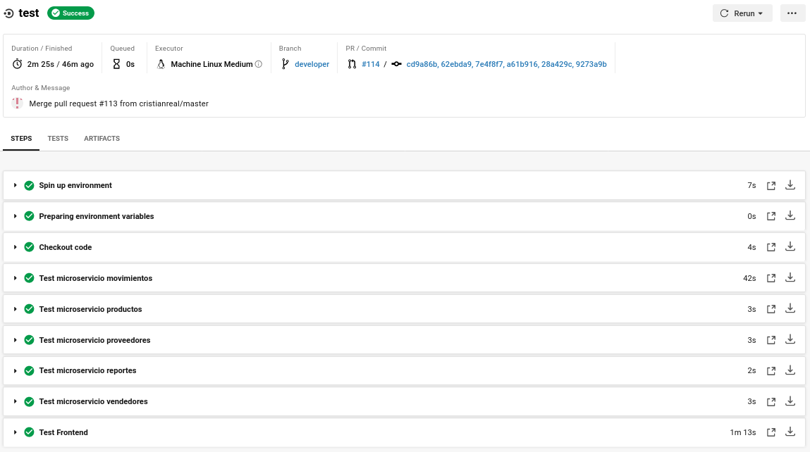
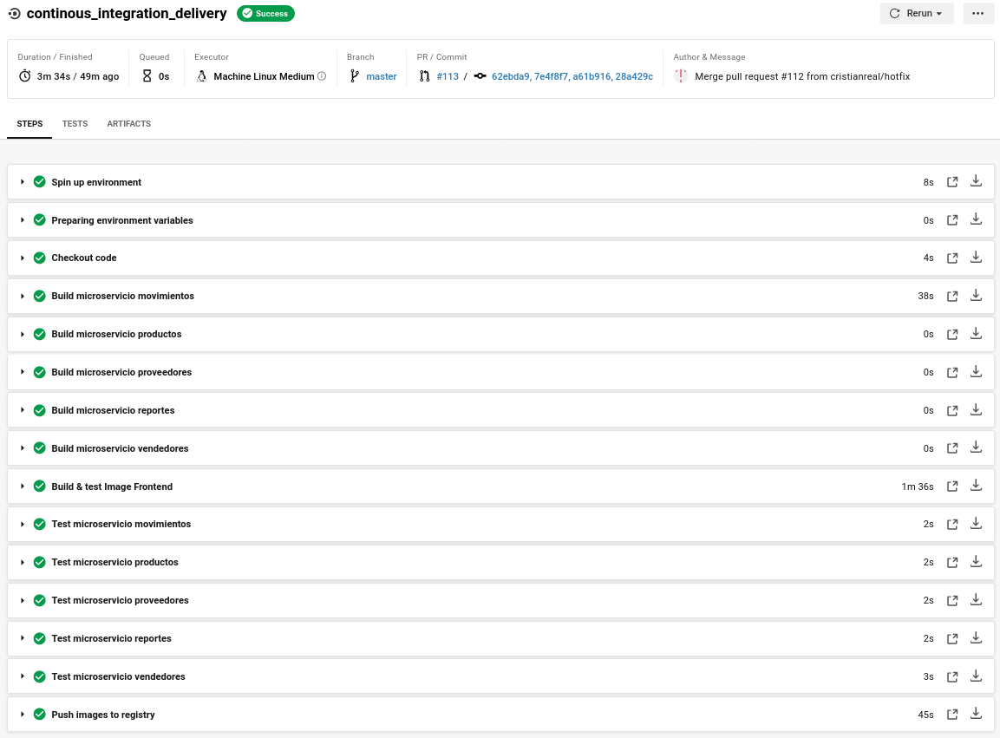

# config.yml 

# Conceptos importantes

## Branches
El repositorio de github adopta una estrategia que permite separar las versiones inestables de las versiones probadas y listas para desplegar.

- master:
```
Cada commit en esta rama significa una nueva version del sistema de inventario.
```
- hotfix: 
```
Al presentarse un error en master se resuelve bajando los cambios a esta rama para arreglarlo y luego volver a subirlo a master.
```
- developer: 
```
En esta rama se integran los cambios que se realizan tanto en los microservicios de backend con el frontend para encontrar problemas de incompatibilidad lo mas pronto posible.
```
- backend: 
```
En esta rama se realizaran los commits de todo el codigo relacionado a los microservicios del backend, los microservicios estan escritos en nodejs.
```
- frontend: 
```
En esta se realizaran los commits de todo el codigo relacionado al frontend que esta escrito en vuejs 
```
- infrastructure: 
```
En esta rama se realizaran los commits de todo el codigo relacionado a los archivos .tf de terraform para aprovisionar la infraestructura en la que se ejecutara la aplicacion, y los archivos .yml de los objetos que se desplegaran en el cluster GKE.
```

## Workflow


Un workflow es la automatizacion de la ejecucion de un conjunto de jobs. Es mediante un workflow (o pipeline como se le conoce tambien) que existe la posibilidad de realizar continous integration y continous delivery de un proyecto. 
CircleCI por defecto ejecuta de manera simultanea los jobs, sin embargo, para ejecutarlo de manera secuencial hay que indicar explicitamente de que job depende para ejecutarse


## Job

Un job consiste en un conjunto de pasos (steps) que se ejecutan en una maquina virtual, imagen, orbe (concepto propio de CircleCI), etc.

Para los jobs de este proyecto se utilizaron principalmente maquinas virtuales con ubuntu 16.04 e imagenes docker del SDK de google.

# Estructura

A continuacion una vista general del archivo config.yml que circle ci lee, interpreta y ejecuta. 
```
version: 2.1
jobs:
  test:
    ...
  continous_integration_delivery:
    ...
  continous_deployment:
    ...
  infrastructure_deployment:
    ...
  
workflows:
  version: 2
  pipeline-principal:
    jobs:
      - test:
          filters:
              branches:
                only:
                  - developer
      - continous_integration_delivery:
          filters:
              branches:
                only:
                  - master
                  - hotfix
      - continous_deployment:
          requires:
            - continous_integration_delivery
          filters:
              branches:
                only:
                  - master
                  - hotfix
      - infrastructure_deployment:
          filters:
              branches:
                only:
                  - infrastructure
```

# Jobs

- **test**:
  - Se ejecuta en una **maquina virtual ubuntu-1604:201903-01**
  - En este job se ejecutan las pruebas en todos los microservicios que componen el backend y en el microservicio de frontend para asegurar la calidad de las nuevas versiones del sistema. 
    - Para cada microservicio del backend se crea una imagen y ejecuta un contenedor para ejecutar las pruebas. 
    - Para el frontend solo se crea la imagen y esta a su vez ejecuta las pruebas durante la construccion de esta.



- **continous_integration_delivery**: 
  - Se ejecuta en una **maquina virtual ubuntu-1604:201903-01**
  - Cuando una version sube a master esta debe de integrarse por lo que se construyen las imagenes, se ejecutan los tests y si todo esta correcto entonces se suben las imagenes a docker para que estas puedan ser utilizadas por los deployments de K8 a la hora de desplegarlas.



- **continous_deployment**: 
  - Se ejecuta en una **maquina virtual ubuntu-1604:201903-01**
  - Depende de la correcta ejecucion del job **continous_integration_delivery**
  - En este job los paso son los siguientes
    - Instalar Terraform y Kubectl.
    - Obtener de terraform el archivo config del cluster GK8 que se ejecutando.
    - Utilizando el archivo config de GK8 conectarse al cluster:
      - Desplegar todos los deployments
      - Modificar la imagen de los contenedores de los deployments con las nuevas imagenes generadas durante el proceso de **continous_integration_delivery** (cada nueva version lleva consigo el SHA del commit que genero la ejecucion del pipeline)
    - Desplegar todos los services que hagan posible alcanzar a los servicios.
    - Aplicar en el cluster las reglas definidas en el ingress-principal, el cual se encarga de mapear el trafico externo al service correspondiente.


  
- **infrastructure_deployment**: 
  - Se ejecuta en una **maquina virtual ubuntu-1604:201903-01**
  - En este job los paso son los siguientes:
    - Instalar Terraform, Kubectl y Helm.
    - Desplegar la infrastructura en GCP utilizando Terraform.
    - Instalar el ingress controller en el cluster GK8 aprovisionado en el paso anterior.
    - Configurar certificados SSL en el ingress controller.
    - Instalar prometheus y grafana via Helm.
    - Agregar nuevos registros DNS en la zona DNS que apunten a la infraestructura creada con terraform.


## workflows

Solo existe un workflow:
- ***pipeline-principal***
Sin embargo este ejecuta diferente jobs dependiendo de la rama origen del commit que dispara el workflow en CircleCi.

### Rama infrastructure


### Rama developer


### Rama master


### Rama hotfix


solamente se definira un flujo de trabajo como el siguientes
```
workflows:
  version: 2
  pipeline-principal:
    jobs:
      - test:
          filters:
              branches:
                only:
                  - developer
      - continous_integration_delivery:
          filters:
              branches:
                only:
                  - master
                  - hotfix
      - continous_deployment:
          requires:
            - continous_integration_delivery
          filters:
              branches:
                only:
                  - master
                  - hotfix
      - infrastructure_deployment:
          filters:
              branches:
                only:
                  - infrastructure
```