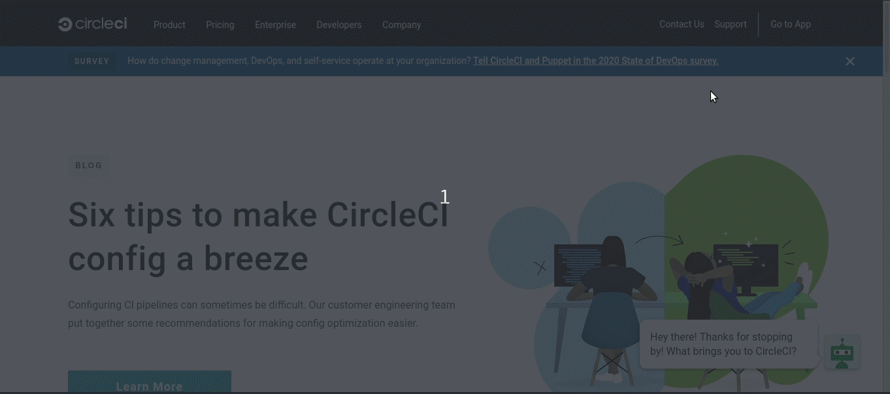
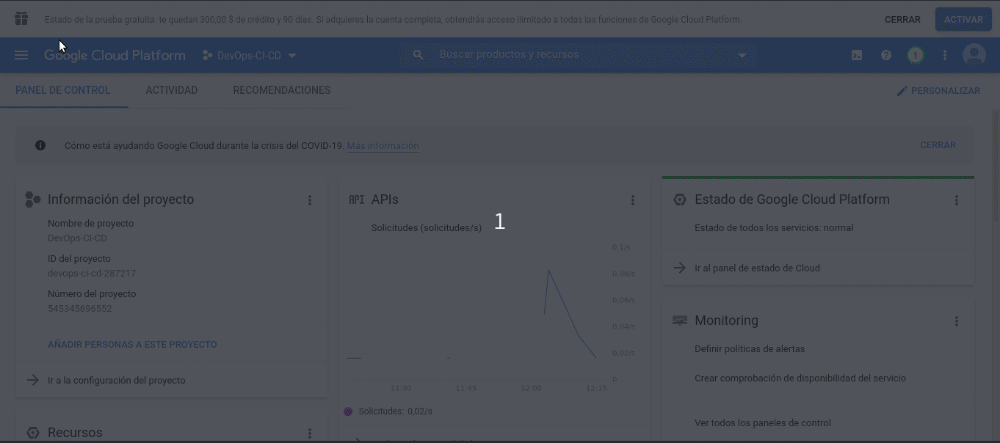
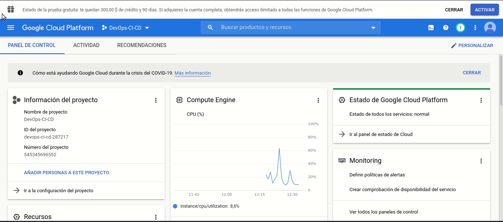

# DevOps-CI-CD

# Getting Started

Para que las herramientas funcionen se deben de configurar ciertos recursos y servicios en Google Cloud Platform.
## Paso 1: 
Crear un proyecto


## Paso 2: 
Crear una cuenta de servicio y crear una clave JSON para acceder al proyecto via CLI

s
## Paso 3: 
Crear un Bucket de nombre "backend-terraform-devops-ci-cd" con permisos uniforme


## Paso 4: 
Agregar variables de entorno al repositorio que se esta siguiendo en CircleCI.
  - CREDENTIALS: El valor de esta variable entorno es el contenido completo de la clave JSON generada en el paso 2
  - DOCKERHUB_PASS: El password de la cuenta de docker hub para subir las imagenes (artefactos)
  - DOCKERHUB_USERNAME: El nombre de usario utilizado para logearse en Docker Hub
  - GOOGLE_COMPUTE_ZONE: La zona en la que se quieren desplegar los recursos (se recomiend us-central1-a)
  - PROJECT_ID: El id del proyecto creado en GCP. 


## Paso 5:
Crear una zona DNS de nombre "zona" para "poliformas.com.gt."


## Paso 6:
Antes de desplegar los recursos se deben de habilitar las siguientes APIS en google cloud platform
- Cloud SQL Admin API
- Kubernetes Engine API


## Paso 7:
Desplegar la infraestructura, sin embargo, para esto se debe de tener instalado de manera local:
- Terraform 0.12.28
  - Para esto se puede utilizar el script que se encuentra en deployment/Terraform/script.sh

Luego de instalar estas dos herramientas se deben de establecer algunas variables de entorno.
```
  export GOOGLE_APPLICATION_CREDENTIALS="ruta del archivo json descargado"
  export TF_VAR_project_id="Id del proyecto"
```
se debe de cambiar al directorio 
```
  deployment/Terraform
```
y ejecutar los siguientes comandos
```
  terraform init
  terraform plan -out plan.out
  terraform apply plan.out
```
Los recursos estaran en proceso de creacion..


Luego de cierto tiempo los recursos habrán terminado de ejecutarse


# Paso 8
Configurar infraestructura. Se puede hacer localmente pero se recomienda agregar un # al final de este archivo y realizar un commit para que se dispare el workflow de circle ci y se encarge de configurar.


# Herramientas
- Github
- CircleCi
- Docker
- Kubernetes


# Como funcioná?
Tod comienza creando una carpeta .circleci dentro del repositorio. Esta carpeta es la que contendrá un archivo de nombre *config.yml* con el flujo completo a realizar por cada commmit.

## config.yml - estructura
El archivo config.yml es un archivo que consistira de algunos bloques importantes.
(En circle ci se utilizan job para ejecutar una secuencia de pasos y workflows para ejecutar un conjunto de jobs [Si se escribe una lista entonces se ejecutaran de manera simultanea, para ejecutarlo secuencial hay que indicar que job requiere para ejecutarse])
```
version: 2.1
jobs:
  //Todos los jobs iran definidos aqui
workflows:
  version: 2
  nombre-pipeline:
    jobs:
      - job1
      - job2
      - job3   
```

# Jobs

* **test**: se ejecutan un echo, pero debe de cambiarse con el comando que ejecuta pruebas unitarias 
```
  test:
    machine: # executor type
      image: ubuntu-1604:201903-01 # # recommended linux image - includes Ubuntu 16.04, docker 18.09.3, docker-compose 1.23.1
    steps:
      - checkout # Descarga el repositorio
      - run:
          name: "test"
          command: |
            echo "ejecutando pruebas unitarias"
```
* **ci**: Se Crea nuevas imagenes y se suben a DockerHub
```
  ci:
    machine: # executor type
      image: ubuntu-1604:201903-01 # # recommended linux image - includes Ubuntu 16.04, docker 18.09.3, docker-compose 1.23.1
    steps:
      - checkout # Descarga el repositorio
      - run:
          name: "Build Image"
          command: |
            cd code/frontend
            docker build -t christianreal/ejemplo-ci-cd:${CIRCLE_SHA1} . 
      - run:
          name: "Push image to registry"
          command: |
            echo "$DOCKERHUB_PASS" | docker login -u "$DOCKERHUB_USERNAME" --password-stdin
            docker push christianreal/ejemplo-ci-cd:${CIRCLE_SHA1}
```
* **cd**(continuous deployment): Desplegar infraestructura en terraform
```
  cd:
    machine: # executor type
      image: ubuntu-1604:201903-01 # # recommended linux image - includes Ubuntu 16.04, docker 18.09.3, docker-compose 1.23.1
    steps:
      - checkout  # Descarga el repositorio
      - run:
          name: "Instalar terraform & Crear archivo de credenciales."  
          command: |
            sudo bash deployment/script.sh
            echo ${Credenciales} > ${HOME}/gcloud-key.json
      - run:
          name: "Desplegar infraestructura con terraform"
          command: |
            cd deployment/Terraform
            export GOOGLE_APPLICATION_CREDENTIALS=${HOME}/gcloud-key.json
            export TF_VAR_project_id=${PROJECT_ID}
            terraform init 
            terraform plan -out plan.out
            terraform apply plan.out
```
* **deploy**: Desplegar applicación conectandose a GCP a traves del sdk y ejecutando comandos para aplicar los archivos de kubernetes.
```
  deploy:
    docker: 
      - image: google/cloud-sdk    
    steps:      
      - checkout
      - run:          
          name: Auth gCloud SDK 
          command: |
            #!/bin/sh
            set -e
            echo ${Credenciales} > ${HOME}/gcp-key.json
            gcloud auth activate-service-account --key-file ${HOME}/gcp-key.json
            gcloud --quiet config set project ${PROJECT_ID}
            gcloud config set compute/zone ${GOOGLE_COMPUTE_ZONE}
            gcloud container clusters get-credentials my-gke-cluster --region us-central1 --project striped-temple-282417
      - run:          
          name: Apply kubernetes files to the cluster
          command: |
            kubectl apply -f deployment/K8/deployments/deployment-nginx.yml
            kubectl set image deployment/deployment-nginx nginx-container=christianreal/ejemplo-ci-cd:${CIRCLE_SHA1} --record
            kubectl apply -f deployment/K8/services/service-nginx.yml
```
## workflows
solamente se definira un flujo de trabajo como el siguientes
```
workflows:
  version: 2
  pipeline-principal:
    jobs:
      - ci
      - cd:
          requires:
            - ci
      - deploy:
          requires:
            - cd  
```
### Variables de entorno
Las variables de entorno que se deben de configurar en el proyecto de circleCi son:
* **DOCKERHUB_PASS**: Password docker hub
* **DOCKERHUB_USERNAME**: Nombre de usuario docker hub
* **Credenciales**: JSON completo de la cuenta de servicio
* **PROJECT_ID**: Id del proyecto de GCP.
* **GOOGLE_COMPUTE_ZONE**: Nombre de la zona de google compute (us-central-1, us-west-2, etc)

#