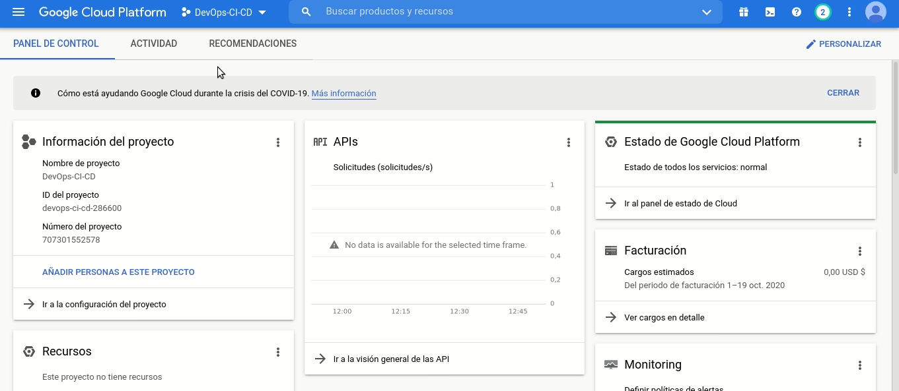

# DevOps-CI-CD

# Manuales

- [Manual de usuario](./manuales/)

## Jerarquia de archivos
```
.
├── .circleci
│   ├── config.yml
│   └── README.md
├── code
│   ├── backend
│   └── client
├── db
│   ├── filename.sql
│   ├── init.sql
│   └── scripts
├── deployment
│   ├── K8
│   └── Terraform
├── manuales
│   ├── Gifs
│   └── Readme.md
└── README.md
```

## Modulos
- [.circleci](/.circleci)
- [code](./code)
- [db](./db)
- [deployment](./deployment)

# Como funciona?
El proceso de DevOps CI/CD trabaja con un flujo de trabajo que se detalla en el archivo [.circleci/config.yml](.circleci/config.yml). 

# Primeros Pasos

Para que las herramientas funcionen se deben de configurar ciertos recursos y servicios en Google Cloud Platform.
## Paso 1: 
Crear un proyecto


## Paso 2: 
Crear una cuenta de servicio y crear una clave JSON para acceder al proyecto via CLI


## Paso 3: 
Crear un Bucket de nombre "backend-terraform-devops-ci-cd" con permisos uniforme


## Paso 4: 
Agregar variables de entorno al repositorio que se esta siguiendo en CircleCI.
  - **CREDENTIALS**: El valor de esta variable entorno es el contenido completo de la clave JSON generada en el paso 2
  - **DOCKERHUB_PASS**: El password de la cuenta de docker hub para subir las imagenes (artefactos)
  - **DOCKERHUB_USERNAME**: El nombre de usario utilizado para logearse en Docker Hub
  - **GOOGLE_COMPUTE_ZONE**: La zona en la que se quieren desplegar los recursos (se recomiend us-central1-a)
  - **PROJECT_ID**: El id del proyecto creado en GCP. 
  


## Paso 5:
Crear una zona DNS de nombre "zona" para "poliformas.com.gt."


## Paso 6:
Antes de desplegar los recursos se deben de habilitar las siguientes APIS en google cloud platform
- Cloud SQL Admin API
- Kubernetes Engine API


## Paso 7:
Desplegar la infraestructura, sin embargo, para esto se debe de tener instalado de manera local:
- Terraform 0.12.28
  - Para esto se puede utilizar el script que se encuentra en deployment/Terraform/script.sh

Luego de instalar estas dos herramientas se deben de establecer algunas variables de entorno.
```
  export GOOGLE_APPLICATION_CREDENTIALS="ruta del archivo json descargado"
  export TF_VAR_project_id="Id del proyecto"
```
se debe de cambiar al directorio 
```
  deployment/Terraform
```
y ejecutar los siguientes comandos
```
  terraform init
  terraform plan -out plan.out
  terraform apply plan.out
```
Los recursos estaran en proceso de creacion..


Luego de cierto tiempo los recursos habrán terminado de ejecutarse


# Paso 8
Configurar infraestructura. Se puede hacer localmente pero se recomienda agregar un # al final de este archivo y realizar un commit para que se dispare el workflow de circle ci y se encarge de configurar.


# Herramientas

## Backend - NodeJS


## Frontend - Vuejs


## Despliegue

- Docker


- Kubernetes


## DevOps Tools

- Terraform


- Circle Ci


