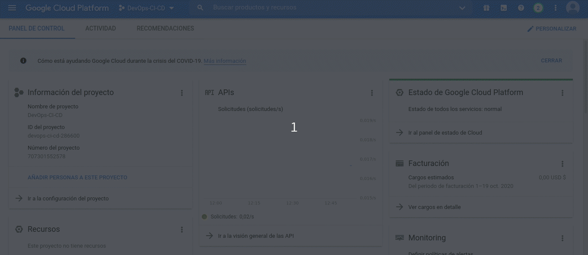
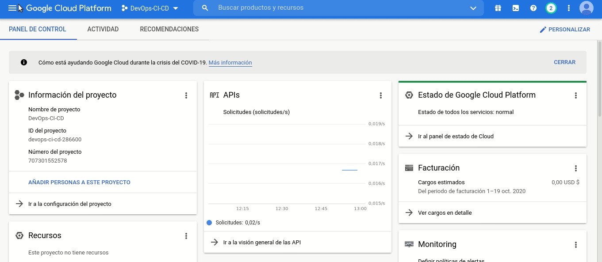
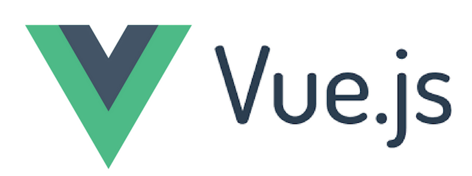
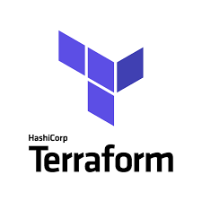

# DevOps-CI-CD

## Jerarquia de archivos
```
.
├── .circleci
│   ├── config.yml
│   └── README.md
├── code
│   ├── client/
|   ├── microservicio-movimientos/
|   ├── microservicio-productos/
|   ├── microservicio-proveedores/
|   ├── microservicio-reportes/
│   └── microservicio-vendedores/
├── db
│   ├── scripts/
│   ├── init.sql
│   └── filename.sql
├── deployment
│   ├── K8/
│   ├── Terraform/
│   └── TerraformDNS/
├── manuales
│   ├── Gifs/
│   └── Readme.md
└── README.md
```

## Documentacion
- [Pipeline CircleCI](/.circleci)
- [Manual Tecnico](./deployment)
- [Manual de usuario](./manuales/)

# Como funciona?
El proceso de DevOps CI/CD emplea un flujo de trabajo que se detalla en el archivo [.circleci/config.yml](.circleci/config.yml). 

# Primeros Pasos

Para que las herramientas funcionen se deben de configurar ciertos recursos y servicios en Google Cloud Platform.
## Paso 1: 
Crear un proyecto


## Paso 2: 
Crear una cuenta de servicio y crear una clave JSON para acceder al proyecto via CLI


## Paso 3: 
Crear un Bucket de nombre "backend-terraform-devops-ci-cd" con permisos uniforme


## Paso 4: 
Agregar variables de entorno en CircleCI.
  - **CREDENTIALS**: El valor de esta variable entorno es el contenido completo de la clave JSON generada en el paso 2
  - **DOCKERHUB_PASS**: El password de la cuenta de docker hub para subir las imagenes (artefactos)
  - **DOCKERHUB_USERNAME**: El nombre de usario utilizado para logearse en Docker Hub
  - **GOOGLE_COMPUTE_ZONE**: La zona en la que se quieren desplegar los recursos (se recomienda us-central1-a)
  - **PROJECT_ID**: El id del proyecto creado en GCP. 
  - **DB_PASSWORD**: El password de la base de datos y cluster GK8.
  - **DB_USERNAME**: El nombre de usuario con el cual se va a poder conectarse a la Base de Datos.
  - **SERVICE_ACCOUNT_NAME** : El nombre del servicio creado en IAM <Ej. Paso2>

  


## Paso 5:
Crear una zona DNS de nombre "zona" para "poliformas.com.gt."


## Paso 6:
Antes de desplegar los recursos se deben de **habilitar** las siguientes APIS en google cloud platform
- Cloud SQL Admin API
- Kubernetes Engine API


## Paso 7:
Para desplegar la infrastructura es necesario tener instalado de manera local:
- Terraform 0.12.28
- Google Cloud SDK
- Kubectl
- Helm

### Pasos:
  - Establecer algunas variables de entorno
    ```
      export GOOGLE_APPLICATION_CREDENTIALS="ruta del archivo json descargado"
      export TF_VAR_project_id="Id del proyecto"
      export TF_VAR_db_username="Nombre de usuario"
      export TF_VAR_db_password="Password de la base de datos y del cluster GK8"
      export TF_VAR_service_account_name='nombre servicio IAM <Ej. Paso2>'
      export VAR_GOOGLE_COMPUTE_ZONE='us-central1-a'
      export RUTADELPROYECTO="ruta del proyecto"
    ```
  - Cambiar al directorio deployment/Terraform
    ```
      cd ${RUTADELPROYECTO}/deployment/Terraform
    ```
  - Ejecutar los siguientes comandos
    ```
      terraform init
      terraform plan -out plan.out
      terraform apply plan.out
    ```
  - Autenticarse con Google SDK y Configurar kubectl para que se conecte al cluster.
    ```
      gcloud container clusters get-credentials $( terraform output --raw cluster_name ) --zone=${VAR_GOOGLE_COMPUTE_ZONE}
      echo "$(terraform output --raw  cloudsql_instance_ip)" > ${RUTADELPROYECTO}/deployment/TerraformDNS/cloudsql_instance_ip
    ```

  - Verificar si hay conexion con el cluster
    ```
    kubectl get nodes -o wide
    ```
  
  # Desplegar aplicaciones en kubernetes 

  - Instalar el ingress controller
    ```
      helm repo add nginx-stable https://helm.nginx.com/stable
      helm install nginx-ing nginx-stable/nginx-ingress
    ```
  - Generar certificados SSL
    ``` bash
      cd ${RUTADELPROYECTO}/
      kubectl apply -f deployment/K8/namespace
      helm repo add jetstack https://charts.jetstack.io
      helm repo update
	    kubectl apply -f https://github.com/jetstack/cert-manager/releases/download/v1.4.0/cert-manager.crds.yaml
      helm install cert-manager jetstack/cert-manager --namespace cert-manager --create-namespace --version v1.4.0
      #kubectl apply --validate=false -f https://github.com/jetstack/cert-manager/releases/download/v0.14.1/cert-manager.yaml
      
      kubectl apply -f deployment/K8/services/letsencrypt-prod.yaml
      kubectl apply -f deployment/K8/configmaps/
      kubectl apply -f deployment/K8/secrets/secret.yaml
	    

      #helm upgrade --install cert-manager --namespace cert-manager jetstack/cert-manager --version v0.14.1
    ```
  - Instalar Prometheus y Grafana
    ```
      cd ${RUTADELPROYECTO}/
      helm repo add grafana https://grafana.github.io/helm-charts
      helm repo add prometheus-community https://prometheus-community.github.io/helm-charts
      helm upgrade --install prometheus prometheus-community/prometheus --namespace prometheus
      helm upgrade --install grafana grafana/grafana --namespace grafana
      kubectl apply -f deployment/K8/services/ingress/ingress-grafana.yaml -n grafana
      kubectl apply -f deployment/K8/services/ingress/ingress-prometheus.yaml -n prometheus   
    ```
  - Crear registros DNS que apunten a los recursos recien creados.
    ```
      cd ${RUTADELPROYECTO}/deployment/TerraformDNS
      external_ip=""; while [ -z $external_ip ]; do echo "Waiting for end point..."; external_ip=$(kubectl get svc --namespace default nginx-ing-nginx-ingress  --template="{{range .status.loadBalancer.ingress}}{{.ip}}{{end}}" --ignore-not-found); [ -z "$external_ip" ] && sleep 10; done; echo "End point ready-" && echo $external_ip; export endpoint=$external_ip          
      export TF_VAR_ingress_controller_ip=${endpoint}
      export TF_VAR_cloudsql_instance_ip=`cat cloudsql_instance_ip`
      terraform init 
      terraform plan -out plan.out
      terraform apply plan.out
    ```


# Tecnologias

## Microservicios Backend - NodeJS


## Frontend - Vuejs



## Despliegue

- Docker


- Kubernetes


- Helm


## DevOps Tools

- Terraform **(infraestructura)**




- Circle Ci **(CI/CD Pipeline)**


- Prometheus **(monitoreo)**


- Grafana **(monitoreo)**


## Cloud Provider


