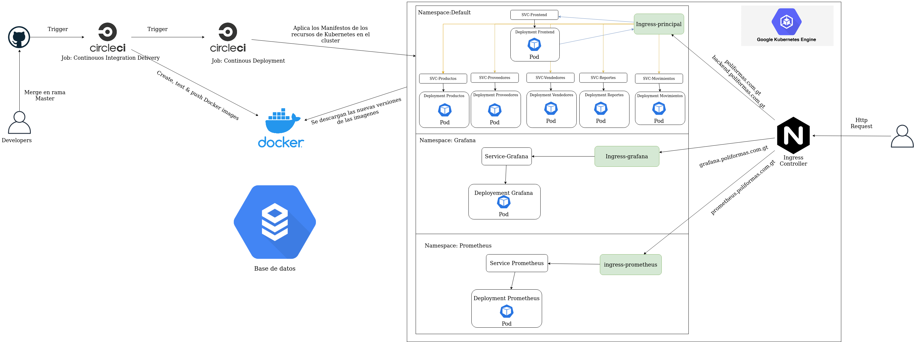

# Arquitectura de la aplicacion

# Monitoreo con Prometheus

https://prometheus.poliformas.com.gt/graph

# Monitoreo con Grafana utilizando prometheus como datasource

https://grafana.poliformas.com.gt/

# workflows

Solo existe un workflow:
- ***pipeline-principal***
Sin embargo este ejecuta diferente jobs dependiendo de la rama origen del commit que dispara el workflow en CircleCi.

## Rama infrastructure

## Rama developer

## Rama master

## Rama hotfix

Este proceso puede encontrarse mas detallado en [Pipeline CircleCI](../.circleci)

# Tecnologias

## Microservicios Backend - NodeJS

## Frontend - Vuejs

## Despliegue

- Docker

- Kubernetes

- Helm

## DevOps Tools

- Terraform **(infraestructura)**

- Circle Ci **(CI/CD Pipeline)**

- Prometheus **(monitoreo)**

- Grafana **(monitoreo)**

## Cloud Provider

