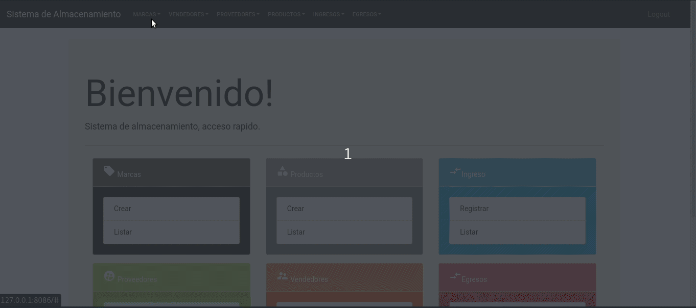
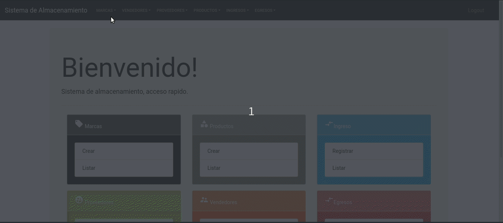
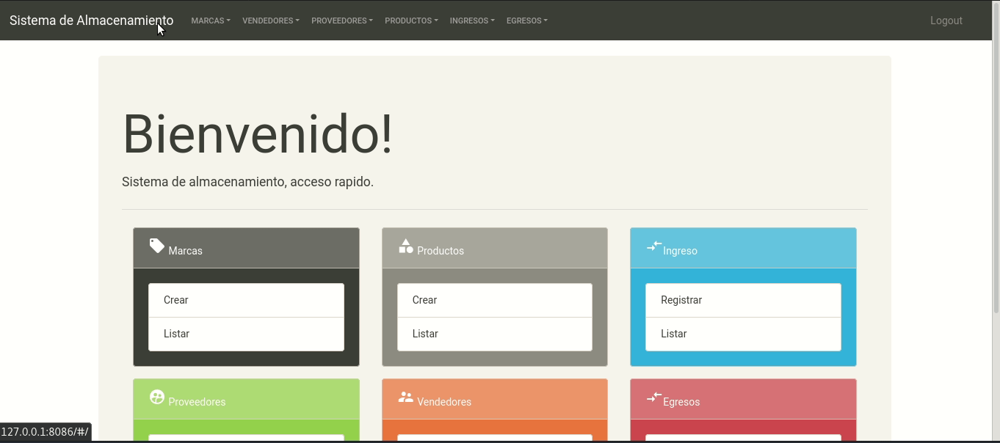
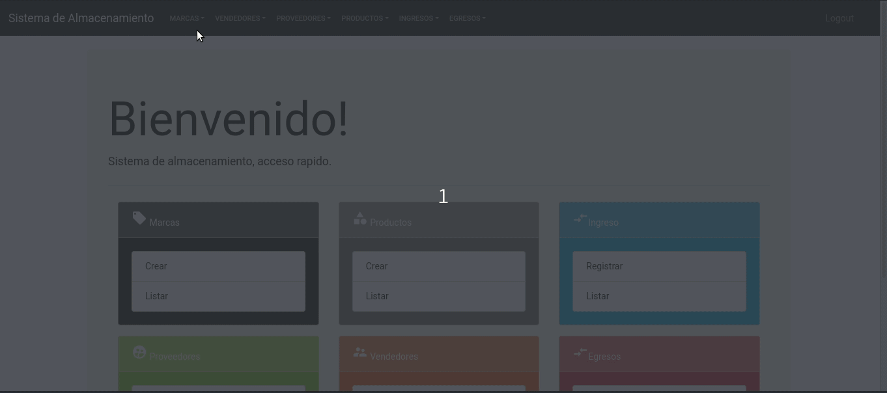
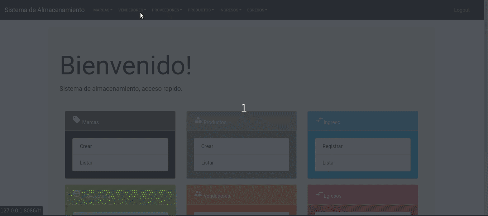
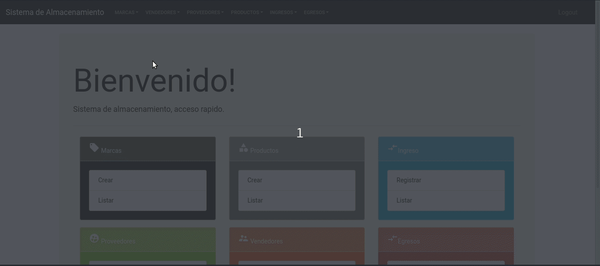
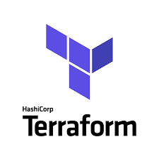

# SISTEMA DE ALMACENAMIENTO

## Modulos 
- [Marcas](#marcas)
- [Vendedores](#vendedores)
- [Proveedores](#proveedores)
- [Productos](#productos)
- [Ingresos](#ingresos)
- [Egresos](#egresos)

## Marcas
El modulo de marcas permite la asociacion de una marca en especiica con el proveedor encargado de distribuirla para tener control sobre quien provee esa marca.

### Acciones
- [Listar Marca](#listar-marca)
- [Crear Marca](#crear-marca)
- [Editar Marca](#editar-marca)
- [Detalle Marca](#detalle-marca)
- [Eliminar Marca](#eliminar-marca)

#### Listar Marca

#### Crear Marca

#### Editar Marca

#### Detalle Marca

#### Eliminar Marca

## Vendedores
El modulo de marcas permite la asociacion de una vendedor en especiica con el proveedor encargado de distribuirla para tener control sobre quien provee esa vendedor.

### Acciones
- [Listar Vendedor](#listar-vendedor)
- [Crear Vendedor](#crear-vendedor)
- [Editar Vendedor](#editar-vendedor)
- [Detalle Vendedor](#detalle-vendedor)
- [Eliminar Vendedor](#eliminar-vendedor)

#### Listar Vendedor

#### Crear Vendedor

#### Editar Vendedor

#### Detalle Vendedor

#### Eliminar Vendedor

## Detalles técnicos
Este sistema de inventario fue desarrollado utilizando una arquitectura de microservicios de la siguiente manera.
### Microservicios

## Tecnologías

### Backend - NodeJS

### Frontend - Vuejs

### Despliegue

- Docker

- Kubernetes

### DevOps Tools

- Terraform

- Circle Ci

