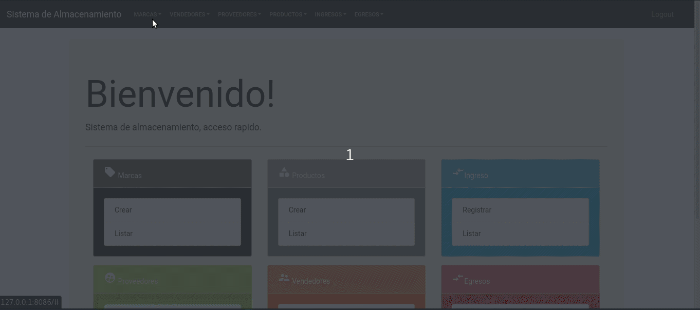
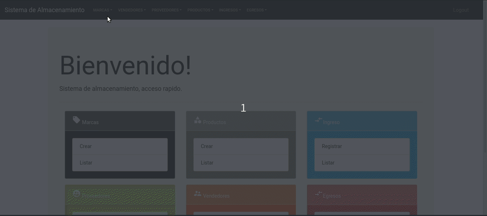
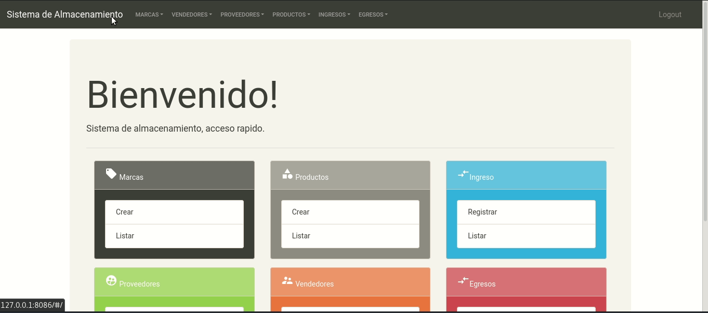
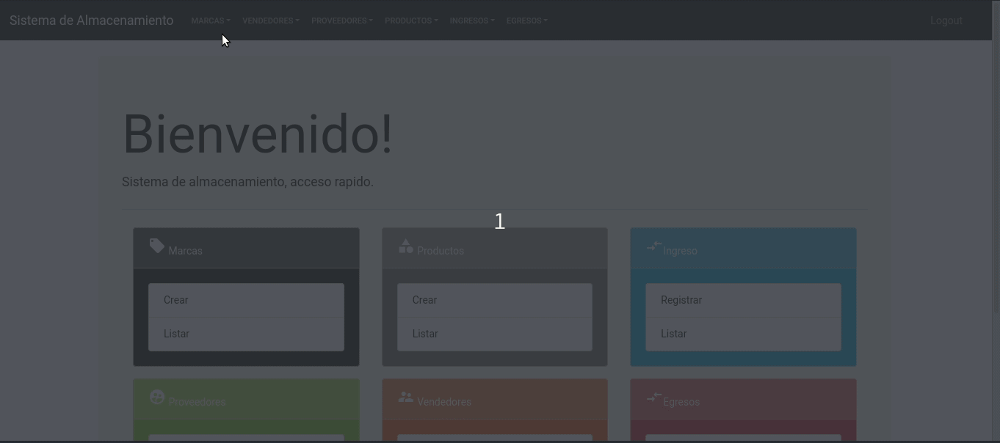

# Sistema de alamacenamiento

## Modulos 
- [Marcas](#marcas)
- [Vendedores](#vendedores)
- [Proveedores](#proveedores)
- [Productos](#productos)
- [Ingresos](#ingresos)
- [Egresos](#egresos)

## Marcas
El modulo de marcas permite la asociacion de una marca en especiica con el proveedor encargado de distribuirla para tener control sobre quien provee esa marca.

### Acciones
- [Crear Marca](#crearmarca)
- [Listar Marca](#listarmarca)
- [Editar Marca]()
- [Detalle Marca]()
- [Eliminar Marca]()

#### Crear Marca

#### Listar Marca

#### Editar Marca

#### Detalle Marca

#### Eliminar Marca

## Detalles técnicos
Este sistema de inventario fue desarrollado utilizando una arquitectura de microservicios de la siguiente manera.
### Microservicios
